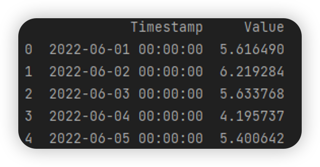

# CSC8112 Machine Learning Engine


## Input data structure

The input data type should be `pandas.DataFrame` with Columns name ["Timestamp","Value"]

Note: All Timestamp data should be reformated as DateTime (i.e. year-month-day hour:minute:second)

Example as follows:



## Output

A figure object of matplotlib.pyplot


## Example code

```py
from ml_engine import MLPredictor

predictor = MLPredictor(pm25_df)
predictor.train()
forecast = predictor.predict()


fig = predictor.plot_result(forecast)
fig.savefig(os.path.join("Your target dir path", "Your target file name))
```


## Others

For more information, please refer to [Yuque Doc](https://www.yuque.com/docs/share/3634cf72-f2d9-4848-ba65-09277a612c87?)